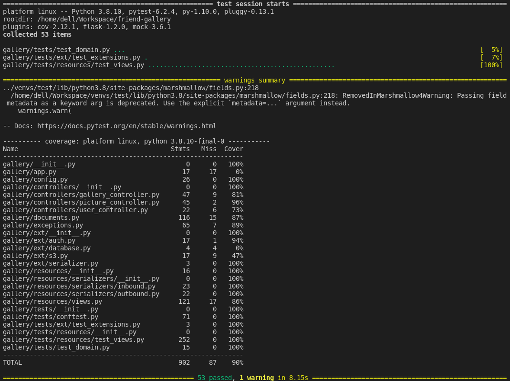

# Getting Started

Full code on [github](https://github.com/HandBoy/friend-gallery).

## Setup Development to run the project
```shell
# Create Virtual Env.
$ python3 -m venv venv-friend  

# Activate Virtual Env.
$ source venv-friend/bin/activate

# Install Requirments.
$ pip install -r requirements/dev.txt

# create .env file and past the values sended for you email.
$ cp .env.template .env

# Run the project.
$ flask run

 * Serving Flask app 'gallery/app.py' (lazy loading)
 * Environment: development
 * Debug mode: on
 * Running on http://127.0.0.1:5000/ (Press CTRL+C to quit)
 * Restarting with watchdog (inotify)
 * Debugger is active!
 * Debugger PIN: 796-444-423
```

### Documentation
```shell
# Run and access Mkdocs
$ mkdocs serve

INFO     -  Building documentation...
INFO     -  Cleaning site directory
INFO     -  Documentation built in 0.30 seconds
INFO     -  [19:46:59] Serving on http://127.0.0.1:8000/
INFO     -  [19:46:59] Browser connected: http://127.0.0.1:8000/
```

### Testes

```shell
# Run all tests
$ pytest

# Run all tests with coverage
$ pytest --cov=gallery

# Run all the tests in a particular test file
$ pytest tests/fields/test_fields.py

# Run only particular test class in that file
$ pytest tests/fields/test_fields.py::TestField
```


## Project Struture
The project use the MVC to share as responsibilities:

- Model: Contains all documents salved in MongoDB, file: documents.py  
- Views: Contains all endpoints, file: resources/views.py
- Controllers: Contains the business logic, file: controllers/*py

Above we have a explanation about all project files:
```
├── docs/                            Project Documentation
├── gallery/                         Application(a documented folder)
│   ├── controllers/                 Contains the business logic
│   │   ├── gallery_controller.py 
│   │   ├── picture_controller.py 
│   │   └── user_controller.py 
│   ├── ext/                         Init external Apps
│   │   ├── auth.py 
│   │   ├── database.py 
│   │   ├── s3.py 
│   │   └── serializer.py 
│   ├── resources/                   Api Views and Serializers
│   │   ├── serializers/             In and Outbouds Schemas 
│   │   └── views.py                 Endpoints
│   ├── tests/                       Tests Files
│   ├── app.py                       Creat Flask App
│   ├── config.py                    Environment variables
│   ├── documents.py                 MongoDB Documents
│   └── exceptions.py                Friend Gallery exceptions 
├── requirements/                    Requirements to run the project
│   ├── base.txt
│   ├── dev.txt
│   └── prod.txt
├── mkdocs.yml                       Mkdocs init  
├── Procfile                         Heroku 
├── README.md (The main readme)
├── requirements.txt                 Used by Heroku to install requirements
└── wsgi                             Used by Heroku to run application
```

## Next Steps

<ul class="task-list">
    <li class="task-list-item">
        <input type="checkbox" disabled="" checked="">
        Paginate Photos
    </li>
    <li class="task-list-item">
        <input type="checkbox" disabled="">
        Add comments in photos
    </li>
    <li class="task-list-item">
        <input type="checkbox" disabled="">
        Docker
    </li>
    <li class="task-list-item">
        <input type="checkbox" disabled="">
        Optimize Mongo Queries
    </li>
</ul>